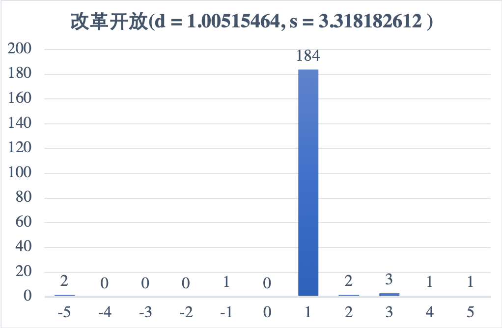

### 1. 频率方法

#### a. 不考虑词性

| collocation | frequency |
|:-----------:|:---------:|
| ('的', '一')  | 684       |
| ('电', '记者') | 602       |
| ('新', '的')  | 597       |
| ('这', '一')  | 538       |
| ('这', '是')  | 456       |
| ('两', '国')  | 451       |
| ('的', '发展') | 441       |
| ('了', '一')  | 434       |
| ('一', '年')  | 429       |

代码见/src/frequency/frequency1a.py，逐个文本逐句处理，过滤标点符号，将所有去词性后的单词存储，采用字典存储所有相邻词对，最后输出出现频次高于5的所有相邻词对。

#### b. 考虑词性

- **/a + /n**

| collocation  | frequency |
|:------------:|:---------:|
| ('贫困', '地区') | 70        |
| ('伟大', '旗帜') | 68        |
| ('困难', '职工') | 68        |
| ('全', '社会')  | 58        |
| ('困难', '企业') | 53        |
| ('高', '技术')  | 52        |
| ('新', '问题')  | 52        |
| ('新', '技术')  | 50        |
| ('贫困', '人口') | 48        |
| ('大', '企业')  | 46        |

代码见/src/frequency/frequency1ban.py，在不考虑词性的基础上，处理单词时不去除词性，将带词性的词存入列表，逐对处理相邻词对符合/a + /n的即存入字典，最后输出所有出现频次高于0且满足词性要求的词对。

- **/n + /n**

| collocation      | frequency |
|:----------------:|:---------:|
| ('领导', '干部')     | 205       |
| ('电', '记者')      | 173       |
| ('金融', '危机')     | 150       |
| ('社会主义', '市场经济') | 108       |
| ('人民', '群众')     | 104       |
| ('金融', '机构')     | 84        |
| ('电力', '设施')     | 76        |
| ('企业', '集团')     | 76        |
| ('特色', '社会主义')   | 74        |
| ('公安', '机关')     | 72        |

代码见/src/frequency/frequency1bnn.py，在不考虑词性的基础上，处理单词时不去除词性，将带词性的词存入列表，逐对处理相邻词对符合/n + /n的即存入字典，最后输出所有出现频次高于0且满足词性要求的词对。

### 2. 均值-方差

#### a. 实现

| collocation | frequency                             |
|:-----------:|:-------------------------------------:|
| ('副', '总理') | \[0, 0, 0, 0, 0, 0, 0, 0, 0, 0, 137\] |
| ('出', '了')  | \[0, 0, 0, 0, 0, 0, 0, 0, 0, 0, 121\] |
| ('的', '要求') | \[0, 0, 0, 0, 0, 0, 0, 0, 0, 0, 130\] |
| ('发展', '的') | \[0, 0, 0, 0, 0, 0, 0, 0, 0, 0, 407\] |
| ('了', '一')  | \[0, 0, 0, 0, 0, 0, 0, 0, 0, 0, 434\] |
| ('一', '系列') | \[0, 0, 0, 0, 0, 0, 0, 0, 0, 0, 139\] |
| ('年', '来')  | \[0, 0, 0, 0, 0, 0, 0, 0, 0, 0, 337\] |
| ('一', '天')  | \[0, 0, 0, 0, 0, 0, 0, 0, 0, 0, 110\] |
| ('这', '一')  | \[0, 0, 0, 0, 0, 0, 0, 0, 0, 0, 538\] |
| ('的', '新')  | \[0, 0, 0, 0, 0, 0, 0, 0, 0, 0, 264\] |

代码见/src/meanVarianece/meanVariancea.py，上表为出现频次大于100的相邻词对在distance为[-5, 5]上按照方差排序的前十位结果，均值前十位是按照frequency[-1]降序排列的前十位。

```python
 # 预处理筛选词频大于100的相邻词对
 one_res = dist_proc(1, 100)
 original = tuple_toDic(one_res)
 for pair in original:
          if not dict_res.__contains__(pair):
           # 采用字典存储词对距离信息
           dict_res.update({pair: [original[pair]]})

 for step in range(-5, 0):
       # 当前词对距离为step，出现频次>0即存入字典
     cur_res = tuple_toDic(dist_proc(step, 0))
     freq_analysis(cur_res, step)
 for step in range(5, 10):
       cur_res = tuple_toDic(dist_proc(step, 0))
     freq_analysis(cur_res, step)
 filter_result_list(dict_res, 100)
```

如上代码片段，实现了统计当前词对distance为[-5, 5]的频次，频次数按照距离值存储在列表中，frequency[-1]存储出现的总频次，计算均值方差时使用列表位置和存储的值进行计算，复杂度很大程度得到优化。

按照词频10，50，100过滤统计的结果分别存储在2a10.xtxt，2a50.txt，2a100.txt中。

#### b. 改革开放均值方差图

| distance（改革 开放） | frequency |
|:---------------:|:---------:|
| -5              | 0         |
| -4              | 0         |
| -3              | 0         |
| -2              | 0         |
| -1              | 1         |
| 0               | 0         |
| 1               | 184       |
| 2               | 2         |
| 3               | 3         |
| 4               | 1         |
| 5               | 1         |

代码见/src/meanVariance/meanVarianceb.py，如上表统计值为“改革  开放”之间distance为[-5, 5]的频次统计，过滤代码如下：

```
# 改革/v  开放/v 
# 改革/vn 开放/vn
for sentence in f:
      sentence = sentence.split()
    # 按照dist正负分类判断是否越界
    if dist >= 0:           
          for pos in range(len(sentence) - 1):
              if pos + dist < len(sentence) and sentence[pos][0:2] == '改革' \
            and sentence[pos + dist][0:2] == '开放':
            single_npair.append((sentence[pos][0:2], sentence[pos + dist][0:2], dist))
    else:
          for pos in range(len(sentence) - 1)[::-1]:
              if pos + dist >= 0 and sentence[pos][0:2] == '改革' \
            and sentence[pos + dist][0:2] == '开放':
            single_npair.append((sentence[pos][0:2], sentence[pos + dist][0:2], dist))
```

按照上表数据计算均值d和方差s，绘制直方图如下：



### 3. 假设检验

#### a. t检验

| （collocation， frequency） | t                  |
|:------------------------:|:------------------:|
| (('的', '一'), 684)        | 12.925488333590877 |
| (('电', '记者'), 602)       | 24.441667867434784 |
| (('新', '的'), 597)        | 20.021450296072235 |
| (('这', '一'), 538)        | 22.307812399460996 |
| (('这', '是'), 456)        | 20.072236660318993 |
| (('两', '国'), 451)        | 21.166880326716285 |
| (('的', '发展'), 441)       | 13.547198087424425 |
| (('了', '一'), 434)        | 17.282105542491077 |
| (('一', '年'), 429)        | 19.920619136024275 |
| (('党', '的'), 419)        | 18.50949972051417  |

代码见/src/hypothesisTest/t_Test.py， 在处理词对同时统计各个单词出现的频次存储到wordcnt字典中，计算t值时取值操作时间复杂度为O(1)。

#### b. 卡方检验

| （collocation， frequency） | X**2               |
|:------------------------:|:------------------:|
| (('的', '一'), 684)        | 381.7392507145041  |
| (('电', '记者'), 602)       | 176443.1809156847  |
| (('新', '的'), 597)        | 2370.81884524138   |
| (('这', '一'), 538)        | 13461.031763504383 |
| (('这', '是'), 456)        | 6819.675903773493  |
| (('两', '国'), 451)        | 136774.37161078985 |
| (('的', '发展'), 441)       | 561.3101738874407  |
| (('了', '一'), 434)        | 1893.0640338340627 |
| (('一', '年'), 429)        | 10515.927550252984 |
| (('党', '的'), 419)        | 3810.2186870548276 |

代码见/src/hypothesisTest/X_quare.py，定义函数统计前缀和后缀词出现的总次数存储到字典，计算卡方值减法操作即可得出不满足条件的词对个数，函数如下：

```python
def find_O1O2(curtext):
    # O1 = curtext[0]
    O2 = curtext[1]
    return aft_res[O2] - dict_res[curtext]

def find_O2O1(curtext):
    O1 = curtext[0]
    # O2 = curtext[1]
    return pre_res[O1] - dict_res[curtext]
```

### 4. PMI

| （collocation， frequency） | PMI                |
|:------------------------:|:------------------:|
| (('的', '一'), 684)        | 1.0129401398415243 |
| (('电', '记者'), 602)       | 8.057218423620292  |
| (('新', '的'), 597)        | 2.498843833863505  |
| (('这', '一'), 538)        | 4.738228011372221  |
| (('这', '是'), 456)        | 4.087665554131353  |
| (('两', '国'), 451)        | 8.27698973366939   |
| (('的', '发展'), 441)       | 1.5240611104568595 |
| (('了', '一'), 434)        | 2.58225517961084   |
| (('一', '年'), 429)        | 4.7389249788926495 |
| (('党', '的'), 419)        | 3.414083695125725  |

代码见/src/PMI/pwMutualInfo.py，PMI函数如下：

```python
def PMI(curpair, t):
    x = word_fre_compute(curpair[0], t)
    y = word_fre_compute(curpair[1], t)
    p = pair_fre_compute(curpair, t)
    pmi = math.log(p / (x * y), 2)
    return pmi
```

### 5. 分析

##### (1) 频率方法

        频率方法中的高频词（> 200）都是一些固定的单字搭配，比如“新  的”，“这  是”，考虑到标注语料库的来源是《人民日报》，次高频词（50 ~ 200）大部分都是政治文化或社会相关性的词组搭配，如“廉政  建设”， “特色  社会主义”，中频词(10 ~ 50)占据了统计结果的很大一部分，多是一些不搭配常用但不适用所有新闻的词对，低频词（0 ~ 9）是整个统计结果中所占比重最大的一部分，多为一些不常用词的搭配，这些搭配也是很难读通，在特定语境下可能出现，如“堵截  排碱渠”，“万象 会见”等。

##### (2) 均值方差法

       根据统计结果，高频词对的均值取决于该词对出现频次最高的distance，比如“改革  开放”词对distance距离为1的词数占98%，则均值d也就可以近似取1，可以从直方图上看出，数据的波动相当大，标准差s = 3.31。因此在高频词中可以预估到，如该词对某一distance占绝大部分出现频率，则方差会很大。对于中频词，d不一定取决于出现频次最高的distance，直方图可以看出数据不再是陡增陡降，方差可预估会减小。对于低频词，d取决于所有出现的distance即其词数，数据波动很小，s将接近1。

##### (3) 假设检验

       根据t检验规则，高频词t值大概落在5~25之间，查表可知单侧置信度高于99%，中频次t值大概落在3-6之间，低频词t值大概落在0~2之间，也会有负值t出现。可知，出现频次越高词对t值越大。


