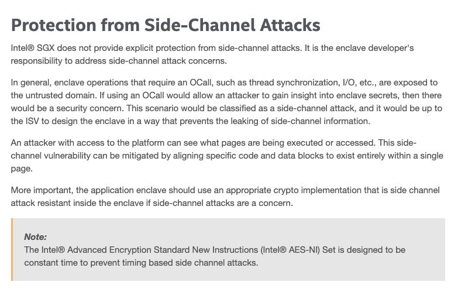

# SGX side channel文献综述

## 1. Intel SGX基础概念

Intel Safe Guard Extentions(SGX)是一组安全相关的指令代码，内置于一些现代英特尔中央处理器(CPU)中。它们允许用户级和操作系统代码定义内存的私有区域，称为enclaves，其内容受到保护，无法被enclaves外的任何进程读取或保存，包括以更高权限级别运行的进程。默认情况下，SGX处于禁用状态，用户必须通过支持的系统上的BIOS设置选择使用SGX。SGX旨在实现安全的远程计算，安全的Web浏览和数字版权管理(DRM)。其他应用包括隐藏专有算法和加密密钥。

SGX涉及CPU对一部分内存进行加密。enclave仅在CPU本身内即时解密，即使这样，也仅限于enclave内部运行的代码和数据。因此，处理器保护代码不被“窥探”或被其他代码检查。enclave中的代码和数据利用威胁模型，其中enclave受到信任，但不能信任其外的进程(包括操作系统本身和任何管理程序)，因此所有这些都被视为潜在的威胁。enclave内的任何代码都无法读取除了加密形式外的enclave内容(如下图所示)。

## 2. SGX侧信道攻击及后果

这一章从SGX内存隔离机制和侧信道攻击面来理解SGX侧信道攻击。

### 2.1 SGX内存隔离

要理解侧信道攻击，首先从理解内存侧信道开始。从第一章SGX基础概念可以知道enclave程序的设计都是围绕内存隔离的宗旨，为了保证这种后向兼容性，英特尔只能通过在处理器架构上不断推出扩展，主要有如下三种。

#### 2.1.1 虚拟内存和物理内存管理

SGX为enclave程序以及它们的控制单元预留了连续的物理内存，称为处理器预留内存Processor Reserved Memory (PRM)。CPU的扩展内存管理单元阻止enclave之外的一切程序获得PRM，包括系统内核、虚拟机hypervisors、SMM代码和DMA。

每个程序的虚拟内存有一个encla线性地址范围Enclave Linear Address Range (ELRANGE)，这是为enclaves预留且映射到EPC页表，机密的代码和数据都存储在ELRANGE。页表负责将虚拟地址转换成不可信系统软件的物理地址，工作方式和传统的TLB没差异。当CPU在non-enclave模式和enclave模式之间转换时，通过EENTER或EEXIT指令或异步Enclave Exits(AEXs)，与当前Process-Context相关联的TLB条目刷新标识符(Process-Context Identifier, PCID)以及全局标识符，防止non-enclave代码获得有关enclave内地址转换的信息。

#### 2.1.2 内存隔离安全检查

为了防止系统软件通过操纵页表条目来任意控制地址转换，CPU还在地址转换期间查询Enclave页面缓存映射(EPCM)。每个EPC页面对应于EPCM中的条目，其记录EPC页面的所有者enclave，页面的类型以及指示页面是否已被分配的有效位。分配EPC页面时，其访问权限在其EPCM条目中指定为可读，可写和/或可执行。映射到EPC页面的虚拟地址(在ELRANGE内)也记录在EPCM条目中。

由不受信任的系统软件设置的页表条目的正确性由扩展的页面错误处理程序(PMH)保证。当代码在enclave模式下执行或地址转换结果落入PRM范围时，将进行额外的安全检查。特别是，当代码在non-enclave模式下运行并且地址转换落入PRM范围，或者代码在enclave模式下运行但物理地址未指向属于当前enclave的常规EPC页面，或者触发页表行走的虚拟地址与EPCM中相应条目中记录的虚拟地址不匹配，将发生页面错误。否则，将根据EPCM条目和页表条目中的属性设置生成的TLB条目。

#### 2.1.3 内存加密

为了支持比EPC更大的ELRANGE，EPC页面可以“交换”到常规物理内存，这个过程称为EPC页面收回。 通过经过身份验证的加密可以保证被收回页面的机密性和完整性。 硬件内存加密引擎(Memory Encryption Engine，MEE)与内存控制器集成在一起，无缝加密EPC页面的内容，该内容被收回到常规物理内存页面。 消息验证代码(Memory Encryption Engine，MAC)保护加密的完整性和与被收回页面相关联的随机数。 加密的页面可以存储在主存储器中，或者交换到类似于常规页面的二级存储器。 但是，与加密相关联的元数据需要由系统软件正确保存，以使页面再次“交换”到EPC中。

### 2.2 侧信道攻击面

由于enclave和non-enclave共享大量的系统资源，这就给侧信道攻击留下了非常大的攻击面。根据[5]中定义可以抽象的可概括为大致三类：**空间粒度**，**时间可观察性**和**Side effects**。

- **空间粒度**

这个概念描述了在内存侧信道攻击期间可直接观察到的最小信息单位。具体来说，它测量一个侧信道观察无法揭示的地址空间的大小。例如，页面错误攻击的空间粒度为4KB，表明即使访问的确切地址没有直接公开，每个错误都使攻击者能够看到一个内存页面(4096字节)。

- **时间可观察性**

给定空间粒度级别，即使攻击者不能直接看到最小信息单元内发生的事情，仍然可以在目标程序的执行期间产生定时信号，以帮助区分程序内的程序所做的不同访问操作。例如，程序停留在页面上的持续时间间接指示是发生单个存储器访存还是多个存储其访问。

- **Side effects**

这个概念主要是用来描述由侧信道攻击引起的可观察异常，从而可以用来检测攻击。 副作用的一个例子是AEX，它经常被页面错误攻击调用。 另一个副作用是执行速度放缓。 由于进行侧信道攻击的主要方法是在内存资源中引起争用，例如刷新缓存，TLB，分页结构缓存，DRAM行缓冲区等，因此将在enclave的运行时性能中增加开销。与此同时AEX也会导致额外的性能开销。

接下来分别按照不同的攻击面对**攻击原理和后果**进行分析。

#### 2.2.1 基于地址翻译缓存

地址翻译缓存是硬件缓存，用来方便地址翻译，包括TLB和各种分页结构的缓存。下面三个因素可导致在地址翻译缓存阶段收到侧信道攻击。

**1. 在超线程中共享的TLB表和分页结构的缓存**

当启用超线程时，在enclave模式下运行的代码可以共享同一组TLB和分页结构高速缓存，但其代码在非enclave模式下运行。 因此，enclave代码对这些资源的使用将干扰非enclave代码的使用，从而产生辅助侧信道。 攻击者可以使用辅助侧信道进行TLB目录的清除等其他操作。

**2. 刷新AEX中TLB和分页结构缓存中的选定条目**

根据英特尔软件开发人员手册的最新版本，进入和离开enclave模式将刷新与当前PCID相关联的TLB和分页结构缓存中的条目。 因此即使在没有超线程的处理器上，来自不同进程的攻击者都能够在上下文切换时推断刷新的条目。

**3. 引用的PTE被缓存为数据**

除了分页结构缓存之外，引用的PTE也将被缓存为常规数据。 攻击者可以通过利用受监控PTE上的FLUSH + RELOAD侧信道，执行跨核攻击以跟踪enclave代码的页级存储器访问模式。 

#### 2.2.2 基于页表

页表是主存中的多层级的数据结构，主要用于地址翻译。页表每次访问都涉及到多层的内存访问，但页表位于操作系统的kernel，当OS kernel被不受信软件占用的时候，就极容易被用来攻击enclave。

典型的页表项的格式(x64)：

下面两个因素可导致在对页表操作时收到侧信道攻击。

**1. enclave模式下*accessed*(图中A)标志位和*dirty*(图中D)标志的更新**

当页表遍历引用PTE时，访问标志位将被设置为1。因此，在非enclave模式下运行的代码将能够检测页表更新并了解相应的enclave代码刚刚访问了EPC页面。页表遍历还将更新TLB条目，以便将来对同一页面的引用不会更新PTE中的已访问标志。在安全性要求极高的工作中这种可以未授权知道标志位的变化以及页表的更新状态是非常不安全的。

**2. enclave模式下触发的页错误**

除了*present*标志位之外，还可以利用PTE中的一些其他位来触发页面错误。 例如，在x86-64处理器上，位M到位51是保留位，当被设置时将触发页错误。

#### 2.2.3 基于缓存和内存层次结构

一旦虚拟地址被翻译成物理地址，内存引用就会同时应用与缓存和内存层次结构，但这些都只是在通电情况下才能存储的暂时行数据。以下两种因素可导致受到侧信道攻击。在层次结构的顶部是单独的L1数据和指令缓存，下一级是专用于一个CPU核心的统一L2缓存，然后由CPU包的所有核心共享L3缓存，然后是主存储器。高速缓存通常构建在静态随机存取存储器(SRAM)和动态随机存取存储器(DRAM)上的主存储器上。上层存储往往更小，更快，更昂贵，而下层存储通常更大，更慢，更便宜。内存提取从上到下遍历每个级别;上层的失误将导致进入下一级别。从较低级别获取的数据或代码通常会更新较高级别的条目，以加快将来的引用。

主存储器通常组织在多个存储器通道中。每个存储器通道由专用存储器控制器处理。一个存储器通道物理地划分为多个DIMM(双列直插存储器模块)，每个DIMM具有一个或两个等级。每个等级具有几个DRAM芯片(例如，8或1​​6)，并且还被划分为多个存储体。存储体阵列携带按行组织的存储器阵列，并且每个行通常具有8KB的大小，由多个4KB存储器页面共享，因为一个页面倾向于跨越多个行。bank上还有一个行缓冲区，用于保存最近访问的行。在提供内存请求之前，每个读取的内存都会将整行加载到行缓冲区中。因此，对行缓冲器中已经存在的DRAM行的访问要快得多。

**1. CPU缓存在enclave和non-enclave模式之间共享代码**

SGX不保护enclave免受缓存侧信道攻击。 因此，所有级别的高速缓存在enclave模式和非enclave模式中的代码之间共享，所有已知的高速缓存侧信道攻击，包括L1数据高速缓存，L1指令高速缓存和L3高速缓存的攻击，都可以用来对enclave进行攻击。

**2. 整个内存的层次架构，包括DIMM、DRAM等，都会在enclave和non-enclave模式之间共享代码**

与高速缓存共享类似，DRAM模块由计算机系统中运行的所有进程共享，因此使用enclave代码和非enclave代码访问存储在同一DRAM库中的存储器是不可避免的。 DRAM行缓冲器可以作为侧信道攻击手段：当目标程序进行存储器引用时，相应的DRAM行将被加载到存储体的行缓冲器中，攻击者可以比较行访问时间以检测是否刚刚访问了特定行，以便推断目标的内存访问。

## 3. 检测及防御方法

在做SGX开发实验的时候我在官方的SGX文档下面找到了`Protection from Side-Channel Attacks`这一章，点进去一看非常有趣，如下图所示：

Intel承认SGX确实无法保证有效地避免侧信道攻击，所以把锅甩给开发者，让开发者在设计SGX程序时来避免侧信道攻击。也因此SGX的侧信道攻击可以成为一个发表论文的热门话题。本章主要介绍对SGX侧信道攻击检测及防御方法。

### 3.1 SGX应用程序开发

攻击者可以通过页面和缓存侧信道以及页面间定时间，跨包围DRAM和超线程等实现对enclave过程的细粒度监控。对于SGX开发人员而言，重要的是要意识到这些新攻击面的影响，从而避免在构建enclave应用程序免通过新侧信道泄漏重要信息。此类解决方案可分为两类：($i$)无侧信道实施(例如，用于加密算法，如AES和RSA)和($ii$)可应用的自动转换工具，但这需要大量的手动工作和有关侧信道攻击的专业知识。

### 3.2 软件级保护

对SGX侧信道泄漏的防御从软件层面来进行保护非常的困难。因为攻击不一定会导致异常高的AEX率，所以检测起来相当的困难。与此同时攻击者还可以使用多个侧信道的组合来进行更强大的攻击，也就是混合侧信道攻击。

- **随机化**

这是Seo等人[4]提出了SGX Shield框架，该框架支持SGX enclave的代码随机化。虽然SGX Shield的主要目标是保护enclave免受可利用的软件bug的影响，但作者提到随机化会给侧信道攻击者带来很多麻烦，特别是它可以提供合理的防止页错误边侧信道攻击的相关保护，强迫攻击者需要暴力破解27次以识别单个地址值。本质上SGX Shield专注于代码的随机化，但不会随机化数据，因此，SGX Shield无法隐藏我们利用的数据访问模式。

- **攻击检测**

之前有人尝试使用系统级监视来检测缓存性能异常，用来应对基于缓存的攻击。但是，此方法不适用于SGX攻击者模型，因为攻击者具有足够的权限来禁用系统级别的任何监视。

### 3.3 硬件增强

到目前为止我们所知道的大多数侧信道攻击问题可以通过硬件改变来缓解，例如，高速缓存/DRAM的分区等。但是硬件变更只能由硬件制造商整合，英特尔SGX没有在架构级别上采用任何针对侧信道攻击的保护措施，所以这在实践中很难实现。

- **缓存禁用**

对基于缓存的侧信道最直接的对策是完全禁用缓存，但这会导致严重的性能下降。 考虑到enclave可能需要处理大型数据集(例如，人类DNA)，执行昂贵的计算(例如，加密)或运行大型应用程序，即使在enclave执行期间缓存禁用代价也是相当高。

- **缓存组织的体系结构**

另一种缓解基于缓存的辅助信道的方法是通过重新设计缓存硬件来引入对策。各种技术主要分为两类，第一类依赖于缓存内存中的访问随机化，第二类使用缓存分区，因此安全敏感代码永远不会共享不受信任的缓存过程。此外，硬件方法也可以与软件防御共存。例如，Sanctum架构为RISC-V平台提供受保护的安全区执行，为最后一级缓存(LLC)应用缓存分区，同时在安全区退出时刷新每核L1缓存。

## 4. 总结

通过对SGX侧信道攻击相关文献的阅读，可以得出结论：SGX侧信道攻击十分难防御，根本的原因在于SGX的安全假设和应用模型允许enclave和不可信的non-enclave共享大量的资源。许多侧信道研究遵循类似的模式：发现了一个新的攻击，然后研究人员立即开始防御攻击。然而大多数防御建议未能考虑所展示的攻击背后的实际出发点，因此他们无法提供有效保护。因此在实际的SGX应用程序的开发中需要注意从软件硬件多个层面来使用保护措施，从而有效的避免侧信道攻击带来的影响。

## 参考文献

**[1]** V. Costan and S. Devadas. Intel SGX Explained. Techni- cal report, Cryptology ePrint Archive. Report                2016/086, 2016.

**[2]** S. Lee, M.-W. Shih, P. Gera, T. Kim, H. Kim, and M. Peinado. Inferring fine-grained control flow inside sgx enclaves with branch shadowing. In 26th USENIX Security Symposium, USENIX Security, 2017

**[3]** M.-W. Shih, S. Lee, T. Kim, and M. Peinado. T-SGX: Eradicating controlled-channel attacks against enclave programs. In Network and Distributed System Security Symposium, 2017.

**[4]** S. Chen, X. Zhang, M. K. Reiter, and Y. Zhang. Detecting privileged side-channel attacks in shielded execution with D´ej´a Vu. In ACM Symposium on Information, Computer and Communications Security, 2017.

**[5]** W. Wang, G. Chen and X. Pan. Leaky Cauldron on the Dark Land: Understanding Memory Side-Channel Hazards in SGX. Conference on Computer and Communications Security. 2017.

**[6]** F. Brasser, U. Muller and A. Dmitrienko. Software Grand Exposure: SGX Cache Attacks Are Practical. 2017.

**[7]** Y. Xu, W. Cui, M. Peinado. Controlled-channel attacks: Deterministic side channels for untrusted operating systems. Proceedings - IEEE Symposium on Security and Privacy. 2015.
