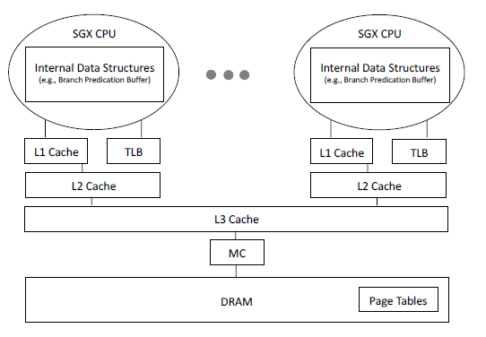

# SGX side channel文献综述

## 1. Intel SGX基础概念

Intel Safe Guard Extentions（SGX）是一组安全相关的指令代码，内置于一些现代英特尔中央处理器（CPU）中。它们允许用户级和操作系统代码定义内存的私有区域，称为enclaves，其内容受到保护，无法被enclaves外的任何进程读取或保存，包括以更高权限级别运行的进程。默认情况下，SGX处于禁用状态，用户必须通过支持的系统上的BIOS设置选择使用SGX。SGX旨在实现安全的远程计算，安全的Web浏览和数字版权管理（DRM）。其他应用包括隐藏专有算法和加密密钥。

SGX涉及CPU对一部分内存进行加密。enclave仅在CPU本身内即时解密，即使这样，也仅限于enclave内部运行的代码和数据。因此，处理器保护代码不被“窥探”或被其他代码检查。enclave中的代码和数据利用威胁模型，其中enclave受到信任，但不能信任其外的进程（包括操作系统本身和任何管理程序），因此所有这些都被视为潜在的威胁。enclave内的任何代码都无法读取除了加密形式外的enclave内容（如下图所示）。

## 2. SGX侧信道攻击

这一章从SGX内存隔离、威胁模型和侧信道攻击面来理解SGX侧信道攻击。

### 2.1 SGX内存隔离

要理解侧信道攻击，首先从理解内存侧信道开始。从第一章SGX基础概念可以知道enclave程序的设计都是围绕内存隔离的宗旨，为了保证这种后向兼容性，英特尔只能通过在处理器架构上不断推出扩展，主要有如下三种。

#### 2.1.1 虚拟内存和物理内存管理

SGX为enclave程序以及它们的控制单元预留了连续的物理内存，称为处理器预留内存Processor Reserved Memory (PRM)。CPU的扩展内存管理单元阻止enclave之外的一切程序获得PRM，包括系统内核、虚拟机hypervisors、SMM代码和DMA。

每个程序的虚拟内存有一个encla线性地址范围Enclave Linear Address Range (ELRANGE)，这是为enclaves预留且映射到EPC页表，机密的代码和数据都存储在ELRANGE。页表负责将虚拟地址转换成不可信系统软件的物理地址，工作方式和传统的TLB没差异。当CPU在non-enclave模式和enclave模式之间转换时，通过EENTER或EEXIT指令或异步Enclave Exits(AEXs)，与当前Process-Context相关联的TLB条目刷新标识符(Process-Context Identifier, PCID)以及全局标识符，防止non-enclave代码获得有关enclave内地址转换的信息。

#### 2.1.2 内存隔离安全检查

为了防止系统软件通过操纵页表条目来任意控制地址转换，CPU还在地址转换期间查询Enclave页面缓存映射（EPCM）。每个EPC页面对应于EPCM中的条目，其记录EPC页面的所有者enclave，页面的类型以及指示页面是否已被分配的有效位。分配EPC页面时，其访问权限在其EPCM条目中指定为可读，可写和/或可执行。映射到EPC页面的虚拟地址（在ELRANGE内）也记录在EPCM条目中。

由不受信任的系统软件设置的页表条目的正确性由扩展的页面错误处理程序（PMH）保证。当代码在安全区模式下执行或地址转换结果落入PRM范围时，将进行额外的安全检查。特别是，当代码在non-enclave模式下运行并且地址转换落入PRM范围，或者代码在安全区模式下运行但物理地址未指向属于当前enclave的常规EPC页面，或者触发页表行走的虚拟地址与EPCM中相应条目中记录的虚拟地址不匹配，将发生页面错误。否则，将根据EPCM条目和页表条目中的属性设置生成的TLB条目。

#### 2.1.3 内存加密

为了支持比EPC更大的ELRANGE，EPC页面可以“交换”到常规物理内存，这个过程称为EPC页面收回。 通过经过身份验证的加密可以保证被收回页面的机密性和完整性。 硬件内存加密引擎（Memory Encryption Engine，MEE）与内存控制器集成在一起，无缝加密EPC页面的内容，该内容被收回到常规物理内存页面。 消息验证代码（Memory Encryption Engine，MAC）保护加密的完整性和与被收回页面相关联的随机数。 加密的页面可以存储在主存储器中，或者交换到类似于常规页面的二级存储器。 但是，与加密相关联的元数据需要由系统软件正确保存，以使页面再次“交换”到EPC中。

### 2.2 威胁模型

侧信道攻击主要目标是攻击enclave数据的机密性（confidentiality）。攻击者来自non-enclave 部分，包括应用程序和系统软件。系统软件包括OS，hypervisor，SMM，BIOS 等特权级软件。

侧信道攻击一般假设攻击者知道enclave初始化时候的代码和数据，并且知道内存布局。内存布局包括虚拟地址，物理地址以及其之间的映射关系。有些侧信道攻击假设攻击者知道enclave的输入数据，并且可以反复触发enclave，进行多次观察记录。侧信道攻击还假设攻击者知道运行enclave平台的硬件配置、特性和性能，比如CPU，TLB，cache，DRAM，页表，中断以及异常等各种系统底层机制。

### 2.3 侧信道攻击面

enclave和non-enclave共享大量的系统资源，这就给侧信道攻击留下了非常大的攻击面。抽象的可概括为大致三类：**Spatial granularity**，**Temporal observability**和**Side effects**。从系统架构来看可概括为下图。

在当今的Intel CPU架构中内存操作设计一连串的微操作：程序通过第一次访问地址翻译缓存集合并遍历内存中的页表生成的虚拟地址被翻译成物理地址，然后这个物理地址被用来获取缓存（L1，L2，L3...）以及DRAM来完成内存引用。下面具体探讨下这个过程中侧信道攻击的实现方式。

#### 2.3.1 基于地址翻译缓存

地址翻译缓存是硬件缓存，用来方便地址翻译，包括TLB和各种分页结构的缓存。下面三个因素可导致在地址翻译缓存阶段收到侧信道攻击。

- 在超线程中共享的TLB表和分页结构的缓存

- 刷新AEX中TLB和分页结构缓存中的选定条目

- 引用的PTE被缓存为数据

#### 2.3.2 基于页表

页表是主存中的多层级的数据结构，主要用于地址翻译。页表每次访问都涉及到多层的内存访问，但页表位于操作系统的kernel，当OS kernel被不受信软件占用的时候，就极容易被用来攻击enclave。

典型的页表项的格式（x64）：

下面三个因素可导致在对页表操作时收到侧信道攻击。

- enclave模式下*accessed*（图中A）标志位的更新

- enclave模式下_dirty_（图中D）标志位的更新

- enclave模式下触发的页错误

#### 2.3.3 基于缓存和内存层次结构

一旦虚拟地址被翻译成物理地址，内存引用就会同时应用与缓存和内存层次结构，但这些都只是在通电情况下才能存储的暂时行数据。以下两种因素可导致受到侧信道攻击。在层次结构的顶部是单独的L1数据和指令缓存，下一级是专用于一个CPU核心的统一L2缓存，然后由CPU包的所有核心共享L3缓存，然后是主存储器。高速缓存通常构建在静态随机存取存储器（SRAM）和动态随机存取存储器（DRAM）上的主存储器上。上层存储往往更小，更快，更昂贵，而下层存储通常更大，更慢，更便宜。内存提取从上到下遍历每个级别;上层的失误将导致进入下一级别。从较低级别获取的数据或代码通常会更新较高级别的条目，以加快将来的引用。

主存储器通常组织在多个存储器通道中。每个存储器通道由专用存储器控制器处理。一个存储器通道物理地划分为多个DIMM（双列直插存储器模块），每个DIMM具有一个或两个等级。每个等级具有几个DRAM芯片（例如，8或1​​6），并且还被划分为多个存储体。存储体阵列携带按行组织的存储器阵列，并且每个行通常具有8KB的大小，由多个4KB存储器页面共享，因为一个页面倾向于跨越多个行。bank上还有一个行缓冲区，用于保存最近访问的行。在提供内存请求之前，每个读取的内存都会将整行加载到行缓冲区中。因此，对行缓冲器中已经存在的DRAM行的访问要快得多。

- CPU缓存在enclave和non-enclave模式之间共享代码

- 整个内存的层次架构，包括内存控制器、信道、DIMM、DRAM等，都会在enclave和non-enclave模式之间共享代码

#### 2.3.4 混合信道攻击

混合侧信道攻击是同时采集多个侧信道攻击面的信息，或通过多个攻击面共同作用放大差异增加准确度。比较典型的做法包括：

1. TLB 和页表混合攻击。比如TLB miss 的时候会加载页表，这个时候CPU 会设置页表的Access bit。 

2. Cache 和DRAM 混合攻击。基于DRAM 的攻击只能精确到row（一个row 通常8KB）的粒度。为了增强这类攻击效果，有文章提出cache-DRAM 攻击来增加空间精度，把精度提高到了一个cache line（64B）。

## 3. 攻击后果

### 3.1 基于TLB的攻击

### 3.2 基于页表的攻击

基于页表的侧信道攻击最典型的就是controlled-channel attack和pigeonholeattack。这类攻击的缺点就是精度只能达到页粒度，无法区分更细粒度的信息。但是在某些场景下，这类攻击已经能够获得大量有用信息。例如下所示，这类基于页表的侧信道攻击可以获得libjpeg 处理的图片信息.经过还原，基本上达到人眼识别的程度。pigeonhole 攻击也展示了大量对现有的安全库的攻击。

### 3.3 基于缓存和内存层级结构攻击

### 3.4 Branch shadowing attack

## 4. 检测及防御方法

上面四个

### 4.4 硬件软件

。。。

## 5. Case study

## 6. 总结

## 参考文献

**[1]** V. Costan and S. Devadas. Intel SGX Explained. Techni- cal report, Cryptology ePrint Archive. Report                2016/086, 2016.

**[2]** S. Lee, M.-W. Shih, P. Gera, T. Kim, H. Kim, and M. Peinado. Inferring fine-grained control flow inside sgx enclaves with branch shadowing. In 26th USENIX Security Symposium, USENIX Security, 2017

**[3]** M.-W. Shih, S. Lee, T. Kim, and M. Peinado. T-SGX: Eradicating controlled-channel attacks against enclave programs. In Network and Distributed System Security Symposium, 2017.

**[4]** S. Chen, X. Zhang, M. K. Reiter, and Y. Zhang. Detecting privileged side-channel attacks in shielded execution with D´ej´a Vu. In ACM Symposium on Information, Computer and Communications Security, 2017.

**[5]** W. Wang, G. Chen and X. Pan. Leaky Cauldron on the Dark Land: Understanding Memory Side-Channel Hazards in SGX. Conference on Computer and Communications Security. 2017.

**[6]** F. Brasser, U. Muller and A. Dmitrienko. Software Grand Exposure: SGX Cache Attacks Are Practical. 2017.

**[7]** Y. Xu, W. Cui, M. Peinado. Controlled-channel attacks: Deterministic side channels for untrusted operating systems. Proceedings - IEEE Symposium on Security and Privacy. 2015.
