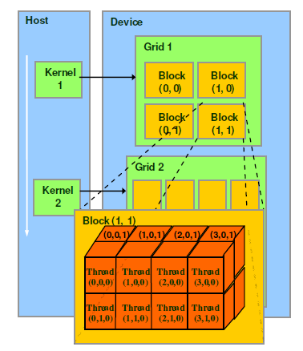
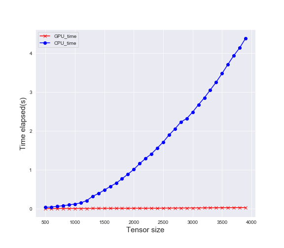

# Data parallelism on GPU with Pytorch

## 1. Introduction

如果深度学习任务无法使用并行处理，那么经济价值就无法得到体现，但是并行可能是一件比较麻烦的事。

传统上，深度学习是在一个单处理器环境中执行的，其中算法的瓶颈可能会导致模型处理过程中出现极大的延迟——从训练到分类、再到距离和误差计算等等。除了最近对神经网络训练的利用，许多深度学习（包括 scikit-learn 这样现成的库和开发者自己实现的算法）都没有使用到并行处理。

这种并行处理的缺乏妨碍了我们使用大量并发式执行的线程（concurrently-executing threads），这些线程可以分别执行不同的任务以实现有经济价值的性能表现。缺乏并行性的原因是多种多样的，其中至少有一点是：并行编程（parallel programming）很难。

当然，并行处理不是万能魔法，并不是对每一种情形都适用；另外在将并行处理整合进某个项目中时，还要考虑实际和理论上的算法设计问题。但是，因为大数据（Big Data）包含了非常大量的数据，其相关的问题也正越来越依赖于常规的深度学习，所以考虑到并行可能在算法执行的时间节省等问题上所带来的价值，其所可能具有的麻烦就是值得我们去面对的了。

### 1.1 General computing on GPU

在适当情况中最常用的并行是使用图形处理单元上的通用计算（GPGPU），这种方法是利用现代高端图形处理器（GPU）的大量处理内核来同时执行计算成本高的任务。尽管并非所有的深度学习任务（或其它软件任务的集合）都受益于 GPGPU，但毫无疑问目前已有大量的高计算成本和高时间成本的任务可以享受到 GPGPU 的优势。修改算法以使其中一些特定的任务可使用 GPU 并-行能够为任务的性能表现和完成速度带来显著的提升。

深度学习算法还可以通过并行处理具有许多相同算法的常见任务来实现性能提升，比如执行矩阵乘法（许多分类任务会用到）、回归、聚类技术、以及特别有价值的线性回归。对于这种在任务执行延迟上的理论加速，还需要说明的一点是：Amdahl 定律说明在整个任务的执行上的理论加速会随着每个系统的资源的增量提升而增加。但是，不管整体的提升幅度如何，理论上的加速都会受到不能受益于并行改进的任务组分的限制。所以它存在一个极限，就像木桶只能装符合最短木板的那么多水一样。

### 1.2 CUDA parallel framework

来自英伟达的 CUDA 并行编程框架是 GPGPU 范式的一种特定的实现。CUDA 曾经是 Compute Unified Device Architecture（计算统一设备架构）的缩写，但英伟达放弃了这种解释，现在就仅使用 CUDA。这种架构可以使用通过 GPU 加速（GPGPU 的另一种说法）的深度学习并行化，它需要特别的条件才能有效地管理可用资源和提供最大化的执行速度增益。

CUDA 在技术上是一种异构计算环境，也就是说它利用了同时在 CPU 和 GPU 上的协调计算。CUDA 架构由主机（host）和设备（device）组成；其中主机是指传统的 CPU，而设备则是指带有大量算术单元的处理器，通常是 GPU。CUDA 提供了传统编程语言的扩展（CUDA 捆绑的原生语言是 C，但也移植或加入了许多其它语言）、可以创建核（kernel，核是指并行执行的函数）。

当一个核被加载时，它会被大量 CUDA 设备的线程同时执行，其中的某个集合可以被称为一个线程块（block of threads），块可以集聚为网格（grid）。线程在块中被排布成三维布局的形式，然后块又在网格中被排布成三维的形式。图 4 给出了这些关系和布局。一个核（kernel）所部属的线程、块和网格的总数量是由该核被加载的主机上所执行的程序员的代码所策略性地规定的，这要基于给定的情况的要求。

重要的是，主机和设备都有自己的内存空间，这些空间是彼此独立的。一个 CUDA 设备只有一个全局内存空间。加载核和产生大量用于计算的设备线程的首要条件是将所需的数据从主机复制到设备内存。一旦计算完成，还必须按相反的方向将结果复制回去。这都是通过 CUDA 扩展来实现的，并且从程序员的视角来看，这都发生在一个非常抽象的层面上。

当管理设备的内存时，给核分配正确的块是很关键的；太少会导致计算能力缺乏，而太多的话则会浪费线程——多余的线程可以被分配给其它同时执行的核。举个例子，在 k-fold 交叉验证建模过程中，这可能会导致分配给特定 fold 的的线程太少，从而导致比预期耗时更长的验证过程。相对地，这也可能导致在 k-fold 交叉验证建模过程中分配了过多的线程，从而让很多线程无法得到使用，进而延长了所有 fold 完成它们的模型验证所需的时间。

幸运的是，设备内存（包括被分配给块和最终的核的线程的数量）的管理是可以被用户定义的（但存在上限，比如每个块最多 1024 个线程）。CUDA 也提供了将这种管理半自动化的聪明方法，让内存管理函数可以将数学表达式用作参数，这样就可以，比如说，在执行的核就能计算出一个数组或矩阵这样的数据结构的大小，然后分配适合其计算的内存大小和维度。

CUDA网格组织如下图所示：



我们提倡并行化的线性回归的一个方面是矩阵乘法——考虑一下矩阵乘法及其在 CUDA 架构上的实现。不考虑矩阵的大小，在高层面上我们假设在设备全局内存中有两个矩阵 M 和 N 相乘，另外还有用于结果矩阵 P 的空间。然后我们将矩阵 M 和 N 复制到设备。

为了简单，我们假设所有矩阵都可以放进一个块中，我们每个块线程都能计算 P 的一个元素。要完成这个计算，每个线程都载入 M 的一行和 N 的一列，计算出点积并将其存储为 P 的对应元素。因为每一个点积都是并行计算出来的，那么其执行矩阵乘法的总时间就是其执行单个点积计算所用的时间。计算完成后，矩阵 P 被从设备内存复制回主机内存，其在这里可以继续被串行代码使用。通常情况下，这样的一次核运算之后，设备内存会解除分配（deallocation）

这是一个高层面的概述。在实际情况下还需要执行一些额外的任务，比如确定块的大小。这也是一个简单的特定案例；但是尽管这种内存管理和设备计算技术必定根据算法的不同而会有所不同，但也可在多种不同的任务之上概括成：确定可并行化的计算、分配设备内存、复制数据到设备、执行并行化的计算、复制结果回主机、继续执行串行代码。注意这里的内存分配和数据复制开销可能会很容易变成瓶颈——这些过程可能会妨碍某些计算时间上的节省。

## 2.  Pytorch

PyTorch是一个由Facebook的AI研究小组的支持建立在torch之上的深度学习库。在最近开发之后，它因其简单，动态图以及编码很pythonic而获得了很多的欢迎，在科研领域与工业届和tensorflow并驾齐驱。

### 2.1 torch.cuda

在pytorch中使用CUDA十分方便，我们可以直接调用torch.cuda这个模块进行操作即可。

- 如下代码展示了如何获得机器的CUDA信息， 包括检查CUDA是否可用、获得默认CUDA设备ID以及获得特定CUDA设备的名字等。具体可以参考附录2.1。

```python
import torch
# Check if CUDA is available
torch.cuda.is_available()
# Get id of default device
torch.cuda.current_device()# 0
# Get name device with id '0'
torch.cuda.get_device_name(0)
# Return the current GPU memory usage by tensors in bytes for a given device
torch.cuda.memory_allocated()
# Return the current GPU memory managed by the caching allocator in bytes for a give device
torch.cuda.memory_cached()
```

- 如下代码展示了如何在GPU上存储tensors并且跑模型

```python
import torch
# Store tensors on CPU
CPU = torch.DoubleTensor([1., 2.])
# Store tensors on GPU
GPU1 = torch.FloatTensor([1., 2.]).cuda()
GPU2 = torch.cuda.FloatTensor([1., 2.])
# Get default device storing your tensors
GPU1.get_device()
# Send a model to CPU
sq = nn.Sequential(
         nn.Linear(20, 20),
         nn.ReLU(),
         nn.Linear(20, 4),
         nn.Softmax()
)
# Then send it to GPU
model = sq.cuda()
# Check if your model is on GPU devices
next(model.parameters()).is_cuda
```

### 2.2 CPU vs GPU

为了比较CPU和GPU的计算能力，运行如下程序：

```python
import torch
import time

###CPU
start_time = time.time()
a = torch.ones(4,4)
for _ in range(1000):
    a += a
elapsed_time = time.time() - start_time
print('CPU time = ',elapsed_time)

###GPU
start_time = time.time()
b = torch.ones(4,4).cuda()
for _ in range(1000):
    b += b
elapsed_time = time.time() - start_time
print('GPU time = ',elapsed_time)
```

 通过修改tensor size，可以得到如下结果：

```python
# torch.ones(4,4)       - default size
CPU time =  0.00926661491394043
GPU time =  0.0431208610534668
# torch.ones(40,40)     - CPU gets slower, but still faster than GPU
CPU time =  0.014729976654052734
GPU time =  0.04474186897277832
# torch.ones(400,400)   - CPU now much slower than GPU
CPU time =  0.9702610969543457
GPU time =  0.04415607452392578
# torch.ones(4000,4000) - GPU much faster then CPU 
CPU time =  38.088677167892456
GPU time =  0.044649362564086914
```

从结果中可以清晰的看到，随着tensor size的不断增大，每次迭代所能并行计算的次数越来越多，从初始的`16`增加到最后的`16000000`。因此从架构上不难理解，CPU的核数少但每一个计算能力都相当强大，GPU单个核计算能力不如CPU但核数相当之多，因此在数据规模较小，单次迭代可并行计算次数有限时CPU的性能还是要优于GPU的，随着计算体量不断增大，CPU的计算时间在到达它计算能力的上限之后会变得很长，而GPU计算时间几乎不怎么变化。

size变化步长为100，500到4000的耗时（代码见附录2.2）如下图所示：



由于GPU所能处理数据的性能远优于CPU，也不难理解深度学习时代计算力的需求全部转移到了GPU之上。由这个例子也可以很清晰地看到并行计算的强大之处，单次迭代并行计算之上，再由多个核进行一个并行迭代，可以对体量庞大的数据“分步击破”，大大提高数据处理的效率。

### 2.3 Multiple GPUs

由2.2小节引出了多核的想法，当一台机器拥有多个GPU时（成本很高），我们就可以使用多个GPU来进行计算等任务。假设你的机器拥有三个GPU，就可以初始化并为每个设备分配名称、任务等。

```python
cuda0 = torch.device('cuda:0')
cuda1 = torch.device('cuda:1')
cuda2 = torch.device('cuda:2')
# If you use 'cuda' only, Tensors/models will be sent to 
# the default(current) device. (default= 0)
x = torch.Tensor([1., 2.], device=cuda1)
# Or
x = torch.Tensor([1., 2.]).to(cuda1)
# Or
x = torch.Tensor([1., 2.]).cuda(cuda1)
```

由于在`PyTorch`中GPU的操作是默认为异步执行的，所以在为每个CPU设备分配任务的时候需要注意其间的依赖关系。下面官方文档给出的例子很好的解释了这一点：

```python
cuda = torch.device('cuda')
s = torch.cuda.Stream()  # Create a new stream.
A = torch.empty((100, 100), device=cuda).normal_(0.0, 1.0)
with torch.cuda.stream(s):
    # because sum() may start execution before normal_() finishes!
    B = torch.sum(A)
```

因此如果想要使用多GPU并行来发挥它们的潜力，就需要注意以下几点：

- 给不同的GPU分配不同的任务/应用程序
- 将每个GPU用于整体或者栈中单个模型，每个GPU都应该有单独的数据副本，因为大多数数据处理是在拟合期间完成的
- 在每个GPU中使用切片输入和模型副本
- 每个GPU将分别计算结果，并将其结果发送到目标GPU，进行进一步的计算等

## 3. Data parallelism

`PyTorch`中数据并行是指我们将小批量样本分成多个较小的小批量并且在多个GPU中并行运行每个较小的小批量的计算。

### 3.1 On the CPU

`Python`中的多线程一直为人诟病，我们从多进程入手探讨一下。主要用到`multiprocessing`中`Pool`和`Process`。`Process`启动单个进程，每次对一个任务都需要启动一个进程很麻烦，所以有`Pool`来实现多个进程同时启动。

使用单进程`Serial`模式和多进程的两种模式`Pool`和`Process`分别对数据处理效率进行测试。这里使用的是模拟`C/S`架构中对`packets`进行处理的程序（代码见附录3.1），数据量为`0 ~ 1000000`。可视化效果如下：


分析可以得出以下结论：

- 如果有很多任务，并且其中很多都不是计算密集型的，那应该使用Process。 因为如果它们是计算密集型的，它们可能会阻塞CPU并且系统可能会崩溃。

- 当有大量的任务而且计算密集时，就应该使用Pool。 因为如果您将它们一次性交付系统，系统可能会崩溃。

### 3.2 On the GPU

`PyTorch`中数据并行是使用`torch.nn.DataParallel`实现的，官方代码见附录2.3。通常，`PyTorch`的`nn.parallel`可以独立使用。 官方已经实现了类似`MPI`的原函数：

- replicate: 在多个设备上复制模块
- scatter: 在第一个维度上分布输入
- gather: 在第一个维度上收集拼接输入
- paralle_aplly: 将一组已经分布好的输入应用到一组已经分布好的模型上

输入维度30✖20，输出维度30✖4，代码示例如下：

```python
# Again we only have one GPU, so we will only use that to see into Dynamics
module =  nn.Sequential(
         nn.Linear(20, 20),
         nn.ReLU(),
         nn.Linear(20, 4),
         nn.Softmax()
).cuda()
inp = torch.ones((30, 20)).cuda()

# Replicate module to devices in device_ids
replicas = nn.parallel.replicate(module, [0])
# Distribute input to devices in device_ids
inputs = nn.parallel.scatter(inp, [0])
# Apply the models to corresponding inputs
outputs = nn.parallel.parallel_apply(replicas, inputs)
# Gather result from all devices to output_device
result = nn.parallel.gather(outputs, 0)
print(result.shape)  # torch.Size([30, 4])
```

等价于直接使用`nn.DataParallel`模块：

```python
model = nn.DataParallel(model, device_ids=[0])
result = model(inp)
```

### 3.3 Combination

CPU和GPU，本是两个司职不同的硬件，就计算能力来比较，也是尺有所短，寸有所长，那是否有可能将两者相结合起来用到模型中来实现效率最大化呢？阅读官方的文档，答案是肯定的。

官方给出了如下一段简单的例子，由CPU计算`embedding`（精度要求高，运算量不大），再由GPU计算`RNN`（运算量大，迭代次数多）。

```python
device = torch.device("cuda:0")

class DistributedModel(nn.Module):
    def __init__(self):
        super().__init__(
            embedding=nn.Embedding(1000, 10),
            rnn=nn.Linear(10, 10).to(device),
        )

    def forward(self, x):
        # Compute embedding on CPU
        x = self.embedding(x)
        # Transfer to GPU
        x = x.to(device)
        # Compute RNN on GPU
        x = self.rnn(x)
        return x
```

## 4. Conclusion

深度学习的浪潮解放了GPU的计算能力，也催生了像`PyTorch`、`TensorFlow`这样优秀的深度学习框架，但似乎发展到这几年这一次的由深度学习推动的人工智能浪潮似乎遇到了瓶颈，因此从学术界和工业界都开始寻找解决的方法，最终大家都将目光转向了基础学科的突破。就譬如一个深度学习的模型略改参数就会得到截然不同的结果，而没有人能解释清楚这其中具体的原因（可视化方面可行但不可信），这说明我们至今任未能洞悉这个“黑盒子”中到底蕴藏着什么。人类至今未能弄清楚生物学上神经元的工作模式，因此距离强人工智能的到来可能只能寄望于下一次的AI浪潮。

总结一下人工智能的发展不难发现，每次的浪潮之巅推动其迅猛发展的最主要原因是计算力的增长。就放在今天，若你的机器没有一块上等的CPU，估计也只能对着`ResNet`望洋兴叹，默默用上了`LR`。因此回望并行与分布式计算这两个大概念的时候，我不得不佩服前人们构想出来如此精巧而又高效率的体系结构。

本文总结了在`Pytorch`框架下使用GPU并行计算能力的相关步骤，同时对比了CPU和GPU下并行计算处理问题的性能差异。相信未来在基础学科的突破和硬件资源增长的基础上，并行计算的应用将更加深入且广泛。

## 5. References

[1] Pytorch parrallelism_tutorial. https://pytorch.org/tutorials/beginner/former_torchies/parallelism_tutorial.html

[2] Speed up your algorithm. https://towardsdatascience.com/speed-up-your-algorithms-part-1-pytorch-56d8a4ae7051

[3] 机器学习中的并行计算：GPU、CUDA和实际应用. https://www.jiqizhixin.com/articles/2016-11-11-3

[4] Deep Learning Framework Examples. https://github.com/ilkarman/DeepLearningFrameworks

[5] CUDA references. [https://en.wikipedia.org/wiki/CUDA](https://en.wikipedia.org/wiki/CUDA)

[6] L. T. Yang and M. Guo. 2005. High-PerformanceComputing: Paradigm andInfrastructure. Wiley. 

[7] E.I. Ioannidis, N. Cheimarios. 2019. On the performance of various parallel GMRES implementations on CPU and GPU clusters.

[8] M. Papadrakakis, G. Stavroulakis, and A. Karatarakis. A new era in scientific computing, domain decomposition methods in hybrid cpu/gpu architectures. Comput. Methods Appl. Mech. Engrg., 200, (2011) 1490-1508.

## 6. Appendix

**2.1** 获取CUDA相关信息

```python
""" Simple class for getting info on all cuda compatible devices """
import pycuda.autoinit

class aboutCudaDevices():
    def __init__(self):
        pass

    def num_devices(self):
        """Return number of devices connected."""
        return cuda.Device.count()

    def devices(self):
        """Get info on all devices connected."""
        num = cuda.Device.count()
        print("%d device(s) found:"%num)
        for i in range(num):
            print(cuda.Device(i).name(), "(Id: %d)"%i)

    def mem_info(self):
        """Get available and total memory of all devices."""
        available, total = cuda.mem_get_info()
        print("Available: %.2f GB\nTotal:     %.2f GB"%(available/1e9, total/1e9))

    def attributes(self, device_id=0):
        """Get attributes of device with device Id = device_id"""
        return cuda.Device(device_id).get_attributes()

    def __repr__(self):
        """Class representation as number of devices connected and about them."""
        num = cuda.Device.count()
        string = ""
        string += ("%d device(s) found:\n"%num)
        for i in range(num):
            string += ( "    %d) %s (Id: %d)\n"%((i+1),cuda.Device(i).name(),i))
            string += ("          Memory: %.2f GB\n"%(cuda.Device(i).total_memory()/1e9))
        return string
```

**2.2** CPU vs GPU

```python
import torch
import time

CPU_time = []
GPU_time = []

def Calculate(size):
    ###CPU
    start_time = time.time()
    a = torch.ones(size, size)
    for _ in range(1000):
        a += a
    elapsed_time = time.time() - start_time
    CPU_time(elapsed_time)

    ###GPU
    start_time = time.time()
    b = torch.ones(size, size).cuda()
    for _ in range(1000):
        b += b
    elapsed_time = time.time() - start_time
    GPU_time.append(elapsed_time)

for i in range(500, 4000, 100):
    Calculate(i)

import matplotlib.pyplot as plt
fig = plt.figure(figsize=[8,7])
plt.plot(range(500, 4000, 100), GPU_time, '-xr', label='GPU_time')
plt.plot(range(500, 4000, 100), CPU_time, '-ob', label='CPU_time')
plt.xlabel('Tensor size', fontsize=15)
plt.ylabel('Time elapsed(s)', fontsize=15)
plt.legend()
plt.savefig('CPU_GPU.png')
```

**2.3** torch.nn.DataParallel

```python
import torch
import torch.nn as nn

class DataParallelModel(nn.Module):
    def __init__(self):
        super().__init__()
        self.block1 = nn.Linear(10, 20)

        # wrap block2 in DataParallel
        self.block2 = nn.Linear(20, 20)
        self.block2 = nn.DataParallel(self.block2)

        self.block3 = nn.Linear(20, 20)

    def forward(self, x):
        x = self.block1(x)
        x = self.block2(x)
        x = self.block3(x)
        return x
```

**3.1** Serial Pool Process

```python
from multiprocessing import Pool, Process

def function(lst):
    arr = np.zeros_like(lst)
    for i in range(lst.shape[0]):
        arr[i] = lst[i] ** 2
    return arr

def serial(n, start=0):
    times = []
    size = []
    for i in range(start, n):
        s = 10**(i+1)
        size.append(s)
        lst = np.random.randint(1, 7, (s,))
        st = time.time()
        res = function(lst)
        en = time.time()
        times.append(en-st)
    return times, size

def paralle_pool(n, sp, start=0):
    times = []
    size = []
    for i in range(start, n):
        s = 10**(i+1)
        size.append(s)
        lst = np.random.randint(1, 7, (s,))
        splitted = np.split(lst, sp)
        with Pool(sp) as p:
            st = time.time()
            res = p.map(function, splitted)
            en = time.time()
        times.append(en-st)
    return times, size

def parallel_process(n, sp, start=0):
    """ 
        sp: Number of splits of array and number of processes
        start: Change it so that split function is able to split
    """
    times = []
    size = []
    for i in range(start, n):
        s = 10**(i+1)
        size.append(s)
        lst = np.random.randint(1, 7, (s,))
        splitted = np.split(lst, sp)
        processes = []
        st = time.time()
        for j in range(sp):
            p = Process(target=function, args=(splitted[j],))
            processes.append(p)
        for p in processes: p.start()
        for p in processes: p.join()
        en = time.time()
        times.append(en-st)
    return times, size
```
